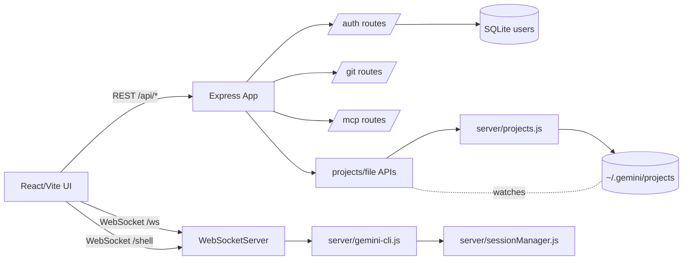

Project Agent Overview (commit 9ef25db @ 2025-08-09T19:38:14-04:00)

Key
- [BP]: Best practices
- [HY]: Hygiene
- [PT]: Patterns
- [TECH]: Tech use

Best practices [BP]
- Consistent ES modules across client/server
- Centralized auth via JWT middleware and protected routes
- WebSocket auth enforced at handshake
- Vite dev proxy for API and WS; chunking heavy deps
- File tree, read, save endpoints with explicit errors

Hygiene [HY]
- ESLint config for browser+node, React hooks, refresh
- Uses single source `api` utility and `authenticatedFetch`
- Encapsulated WS hook with reconnection
- Server-side input validation on key routes

Patterns [PT]
- React contexts for Theme/Auth/Settings
- Feature-oriented components under `src/components`
- Express modular routes (`auth`, `git`, `mcp`), middleware, services (`projects`, `sessionManager`, `gemini-cli`)
- In-memory + file-backed session manager

Tech use [TECH]
- React 18, Vite 7, Tailwind, CodeMirror/Monaco
- Express 4, ws, node-pty, better-sqlite3
- JWT (no expiry), bcrypt, multer
- Mermaid bundled for diagrams

Architecture overview
- Frontend (Vite/React) talks to server via REST (`/api/...`) and WS (`/ws`, `/shell`).
- Server: Express app + single WSS multiplexed by path. Routes: `auth`, `git`, `mcp`, project and file APIs.
- Services: `projects` (Gemini project discovery/cache), `gemini-cli` (spawn, stream, manage sessions), `sessionManager` (persist to `~/.gemini/sessions`).
- DB: SQLite (better-sqlite3) for auth users.

Mermaid


Wiring map (selected)
- Client entry: `src/main.jsx` -> `src/App.jsx` -> `Sidebar`, `MainContent`, `ToolsSettings`, contexts (Theme/Auth), `useWebSocket`, `api`.
- WebSocket: `src/utils/websocket.js` -> `/api/config` for base URL -> `ws://.../ws`.
- Shell WebSocket: `src/components/Shell.jsx` connects to `/shell` on demand, persists terminal session across tab switches.
- REST: `src/utils/api.js` centralizes calls to `/api/auth`, `/api/projects`, `/api/git`, etc.
- Server entry: `server/index.js` builds Express, WSS; mounts `auth`, `git`, `mcp`; file/project routes; serves `dist/` and `index.html` catch-all.
- Auth: `server/middleware/auth.js` (JWT) used on protected routes; tokens generated in `server/routes/auth.js`.
- Projects: `server/projects.js` lists and resolves project paths; used by `/api/projects*`.
- Sessions: `server/sessionManager.js` in-memory + JSON files; used by `gemini-cli.js` and project endpoints.
- Gemini: `server/gemini-cli.js` spawns CLI, streams stdout to WS, persists to `sessionManager`.
- Git: `server/routes/git.js` exec wrapper around git commands with validation.
- MCP: `server/routes/mcp.js` wraps `claude mcp` subcommands.

Improvements for agent awareness and sync
- Centralize runtime “agent state” in a single JSON file (e.g., `/.agent/state.json`) written by server on boot with: ports, wsUrl, commit SHA, build timestamp. Client reads once to avoid drift.
- Add `/api/health` and `/api/version` endpoints returning commit SHA, server start time, and schema versions; surface in UI footer and store in `src/AGENT.md` log.
- Add server-side guard that validates `filePath` is within the resolved project root for file read/save/binary endpoints.
- Replace manual `.env` parsing with `dotenv` and validate required vars at startup; fail-fast in non-dev.
- Parameterize Gemini timeout/model via tools settings persisted server-side; expose `/api/settings` to keep UI and server in sync.
- Add WS ping/pong and exponential backoff in `useWebSocket` to improve presence and reconnect visibility.

Multi-engine compatibility plan (Gemini CLI + Cursor CLI)
- Introduce an engine selector (Gemini or Cursor) after sign-in; persist in localStorage and expose in settings.
- Use a provider factory on client and a runner factory on server to abstract engine-specific behavior.
- Keep .env handling as-is (no dotenv); pass selected engine via WS query and REST headers for routing.

UI/UX
- Engine choice: small dropdown/modal after login; can change later in Tools Settings.
- Header badge shows engine and model/version; click to switch.
- Tool transparency: enhance `ToolUseFeedback` to render actual tool calls (name, args, duration, result) with copy buttons.

Architecture additions (guidance only; no edits applied)
- Client
  - `src/ai/ProviderFactory.js` exposes `createProvider(engine)` returning `{ send, abort, stream, info }`.
  - `GeminiProvider` uses existing `/ws` messages; `CursorProvider` mirrors with engine=cusor semantics.
  - `useWebSocket` appends `engine` to URL and forwards engine in messages.
- Server
  - `server/ai/runnerFactory.js` maps engine -> `{ spawn, abort }` from `gemini-cli.js` or `cursor-cli.js`.
  - `server/cursor-cli.js` mirrors `gemini-cli.js` but spawns `cursor` CLI; streams as generic `ai-response`.
  - WS handler reads `engine` query and delegates to runner.

Tool logging
- Emit structured WS frames `{ type: 'tool', name, args, startedAt, endedAt, status }` from runners.
- Client collects these per assistant message and displays in `ToolUseFeedback` and a sidebar panel.

Git panel (optional future)
- Add stash, reset, revert, cherry-pick endpoints and UI actions; keep status parsing robust.

MCP integration (validated commands/config)
- Claude CLI (authoritative MCP manager today):
  - List servers: `claude mcp list -s user`
  - Add stdio server: `claude mcp add <name> -s user <command> [args...] [-e KEY=VALUE ...]`
  - Add HTTP server: `claude mcp add --transport http <name> -s user <url> [--header 'Key: Value' ...]`
  - Add SSE server: `claude mcp add --transport sse <name> -s user <url> [--header 'Key: Value' ...]`
  - Get server: `claude mcp get -s user <name>`
  - Remove server: `claude mcp remove -s user <name>`
- Gemini CLI configuration file (used by this repo’s `gemini-cli.js` to auto-pass `--mcp-config` when servers exist): create `~/.gemini.json` like:
  ```json
  {
    "mcpServers": {
      "fs": { "command": "node", "args": ["/path/to/mcp-fs.js"] },
      "httpExample": { "transport": "http", "url": "https://mcp.example.com", "headers": { "Authorization": "Bearer <token>" } }
    },
    "geminiProjects": {
      "/absolute/path/to/project": {
        "mcpServers": {
          "search": { "command": "python", "args": ["/path/to/mcp-search.py"] }
        }
      }
    }
  }
  ```
- Engine-neutral plan: keep server endpoints under `/api/mcp/cli/*` delegating to `claude mcp` until official Gemini/Cursor CLI MCP commands are published. The UI surfaces what Claude owns and passes `--mcp-config` to Gemini when present.

Non-destructive engine detection and registry (no assumptions)
- Goal: never hardcode Cursor CLI. Detect locally and record to a registry you control under `~/.gemini/engines.json`.
- Detection you run manually (safe commands only):
  1) Gemini: `which gemini && gemini --version`
  2) Cursor candidates (run each until one works):
     - `which cursor-agent && cursor-agent --version`
     - `which cursor && cursor --version`
     - `which cursor-cli && cursor-cli --version`
  3) Capture the working binary path and version.
- Engine registry file (user-owned; not committed): `~/.gemini/engines.json`
  ```json
  {
    "defaultEngine": "gemini",
    "engines": {
      "gemini": {
        "bin": "/usr/local/bin/gemini",
        "args": [],
        "mcpConfigFile": "~/.gemini.json"
      },
      "cursor": {
        "bin": "/usr/local/bin/cursor-agent",
        "args": [],
        "supportsMcp": false,
        "notes": "Set to true and add MCP details only after you verify cursor MCP support."
      }
    }
  }
  ```
- Usage:
  - UI reads registry to populate the engine dropdown post-login; if `cursor` not present, hide it by default.
  - Server reads registry to find the exact binary path/args to spawn; never guesses.
  - When you later confirm Cursor MCP, flip `supportsMcp` and add MCP config pointers here.

Operator checklist (run locally; paste results into registry)
- Confirm Gemini: `gemini --version`
- Probe Cursor: try `cursor-agent --version`, else `cursor --version`, else `cursor-cli --version`
- Optional: get help text: `<bin> --help` to confirm flags for prompt/session/model

Caution
- Do not add speculative flags. Only add what you verified via `--help` or vendor docs.

Anti-patterns and risks
- JWT tokens never expire; default secret fallback in prod. Consider expiries and env-only secrets. [HY]
- `/api/projects/:projectName/file` and `files/content` accept any absolute path; not constrained to project dir -> potential arbitrary file read. Validate path is within selected project root. [BP]
- `server/routes/git.js` has a bug: `.slice(________);` after a response in discard handler; unreachable/throws. Fix by removing `.slice(________)`. [PT]
- Manual `.env` parsing in `server/index.js`; prefer `dotenv`. [HY]
- `gemini-cli` timeout fixed at 30s; may be too short for long generations. Consider config. [BP]
- WebSocket verify attaches `user` to `info.req` but not used downstream beyond gating; okay but document. [HY]

Notes
- Ports: API default 4008, Vite 4009; proxy in `vite.config.js`.
- Project discovery reads `~/.gemini/projects/<encoded>/...jsonl` and attempts base64 decode fallback.
- Static app served from `dist/` after API routes; wildcard route falls back to SPA.

Log
- 2025-08-09 19:38 (-0400, 9ef25db): Generated agent files; flagged git discard bug, path validation risk, JWT expiry; added Shell WS note and improvement plan.
- 2025-08-09 20:00 (-0400, 9ef25db): Added multi-engine (Gemini + Cursor) plan, provider/runner factories, tool visibility strategy; guidance only, no source edits.
