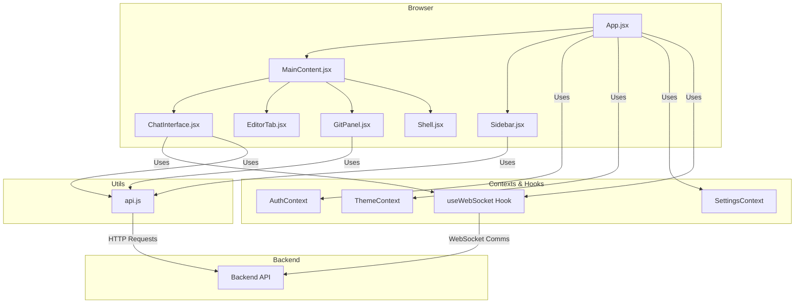

# Gemini CLI UI - Frontend Architecture (`src`)

This directory is the heart of the React frontend application, containing all the components, contexts, hooks, and utilities that make up the user interface.

## Core Principles

*   **Component-Based Architecture:** The UI is built as a collection of reusable and modular React components, promoting separation of concerns and maintainability.
*   **Centralized State Management:** React Context is used to manage global state like authentication (`AuthContext`), theming (`ThemeContext`), and user settings (`SettingsContext`).
*   **Utility-First Styling:** Tailwind CSS is used for all styling, ensuring a consistent and maintainable design system. All custom styles, theme variables (using the modern OKLCH color model), and advanced effects like glassmorphism are defined in `src/index.css`.
*   **Session Protection System:** A critical system is implemented in `App.jsx` to prevent WebSocket updates from disrupting active chat sessions. It intelligently tracks active conversations and pauses disruptive project list refreshes, ensuring a seamless user experience.

## Architecture Diagram

## Key Architectural Patterns

*   **Session Protection System:** This is a crucial feature for UI stability. `App.jsx` maintains an `activeSessions` state (a `Set`). When a user sends a message in `ChatInterface.jsx`, the session ID (or a temporary one for new chats) is added to this set. WebSocket messages of type `projects_updated` are then ignored if the currently selected session is in the active set. The session is marked inactive once the `gemini-complete` or `session-aborted` message is received, resuming updates.
*   **Dual Editor Implementation:** The application uses two different code editors for specific purposes:
    *   **`@monaco-editor/react` (`NewCodeEditor.jsx`):** Used for the main file editing experience in the `EditorTab`, providing a rich, IDE-like environment.
    *   **`@uiw/react-codemirror` (`CodeEditor.jsx`):** A lighter-weight editor used within the `ChatInterface` to display code diffs for the `Edit` tool, optimizing performance within the chat log.
*   **Component-Driven State Flow:** State generally flows downwards from `App.jsx`, which manages the core application state (selected project, session, etc.). Callbacks are passed down to child components (`Sidebar`, `MainContent`) to handle user interactions and update the state in `App.jsx`.

## File & Directory Overview

### `main.jsx`

The entry point for the React application. It renders the main `App` component into the DOM within a `React.StrictMode` wrapper.

### `index.css`

The main stylesheet for the application. It uses Tailwind CSS directives (`@import`, `@theme`) and defines the application's color palette using the OKLCH color model for perceptual uniformity. It also contains custom CSS for advanced UI effects like glassmorphism, neumorphism, and various glow/shadow styles.

### `App.jsx`

The root component of the application. It orchestrates the entire UI and manages the primary application state.

*   **Routing:** Uses `react-router-dom` to manage application routes, including handling session-specific URLs (`/session/:sessionId`).
*   **State Management:** Manages global state such as the list of projects, the currently selected project and session, and the active UI tab.
*   **Component Composition:** Assembles the main UI components like `Sidebar`, `MainContent`, and `MobileNav`.
*   **WebSocket Integration:** Initializes the `useWebSocket` hook to establish and manage the real-time connection with the backend.
*   **Session Protection System:** Implements the core logic to prevent WebSocket updates from disrupting active chat sessions by tracking "active" sessions and pausing project list refreshes until the conversation is complete.

### `components/`

This directory contains all the reusable React components that form the UI.

*   **`AppContent.jsx`:** The main content component that is rendered by the router. It contains the primary layout and logic for the application.
*   **`Sidebar.jsx`:** The main navigation sidebar, displaying the list of projects and sessions. It handles project and session selection, creation, and deletion.
*   **`MainContent.jsx`:** The main content area that displays the active tab's content, such as the chat interface, file tree, or Git panel.
*   **`ChatInterface.jsx`:** The core chat component, responsible for displaying messages, handling user input, and interacting with the WebSocket for real-time communication with the Gemini CLI.
*   **`ChatSidebar.jsx`:** A collapsible sidebar panel that integrates the `ChatInterface` for a more integrated chat experience.
*   **`CodeEditor.jsx`:** A CodeMirror-based editor for displaying code diffs within the `ChatInterface`.
*   **`CodeTabs.jsx` & `NewCodeEditor.jsx`:** A multi-tab code editor system. `CodeTabs` manages the open file tabs, while `NewCodeEditor` (using Monaco Editor) provides the actual code editing functionality.
*   **`DarkModeToggle.jsx`:** A simple toggle switch for changing between light and dark themes.
*   **`EditorFileTree.jsx`:** A file tree component used within the `EditorTab` to navigate the project's file system.
*   **`EditorTab.jsx`:** An integrated code editor tab that combines the `EditorFileTree` and `CodeTabs` components for a full-featured editing experience.
*   **`ErrorBoundary.jsx`:** A component that catches JavaScript errors in its child component tree and displays a fallback UI.
*   **`FileTree.jsx`:** A file tree component that displays the project's file system with different view modes (simple, detailed, compact).
*   **`GeminiLogo.jsx` & `GeminiStatus.jsx`:** Components for displaying the Gemini logo and the status of the Gemini CLI, respectively.
*   **`GitPanel.jsx`:** A dedicated panel for Git source control, allowing users to view changes, stage files, commit, and interact with remote repositories.
*   **`ImageViewer.jsx`:** A modal component for viewing images.
*   **`LoginForm.jsx` & `SetupForm.jsx`:** Components for user authentication and initial setup.
*   **`MicButton.jsx`:** A button component that uses the `useAudioRecorder` hook to record audio and send it to the Whisper API for transcription.
*   **`MobileNav.jsx`:** A bottom navigation bar for mobile devices.
*   **`ProtectedRoute.jsx`:** A higher-order component that protects routes from unauthenticated access.
*   **`TodoList.jsx`:** A component for displaying and managing a todo list.
*   **`ToolsSettings.jsx`:** A modal component for configuring tool permissions and other settings.
*   **`ui/`:** A collection of primitive UI components like `Button`, `Input`, and `Badge`, styled with `class-variance-authority`.

### `contexts/`

This directory manages global state using React Context.

*   **`AuthContext.jsx`:** Handles user authentication state, providing `login`, `register`, and `logout` functions, and managing the user's JWT.
*   **`ThemeContext.jsx`:** Manages the application's theme (light/dark mode) and applies the corresponding styles to the document.
*   **`SettingsContext.jsx`:** Manages user-configurable settings, such as tool permissions and project sorting preferences, persisting them to `localStorage` and notifying other components of changes via a `StorageEvent` listener.

### `hooks/`

This directory contains custom React hooks for reusable logic.

*   **`useWebSocket.js`:** A custom hook that encapsulates the logic for establishing and managing the WebSocket connection with the backend, including message handling and reconnection attempts.
*   **`useVersionCheck.js`:** A hook that periodically checks for new releases of the application on GitHub and provides information about available updates.
*   **`useAudioRecorder.js`:** A hook for managing audio recording functionality, used by the `MicButton` component.

### `lib/`

*   **`utils.js`:** Contains general utility functions, most notably the `cn` function for merging Tailwind CSS classes.

### `utils/`

This directory contains application-specific utilities.

*   **`api.js`:** A centralized utility for making authenticated `fetch` requests to the backend API, automatically attaching the JWT to each request. It exports a structured `api` object that organizes endpoints by category (e.g., `api.auth`, `api.projects`).
*   **`websocket.js`:** Provides the `useWebSocket` hook for managing the WebSocket connection.
*   **`whisper.js`:** A utility for interacting with the OpenAI Whisper API for speech-to-text transcription, used by the `MicButton` component.
*   **`notificationSound.js`:** A utility for playing a notification sound when Gemini completes a response, using the Web Audio API.
